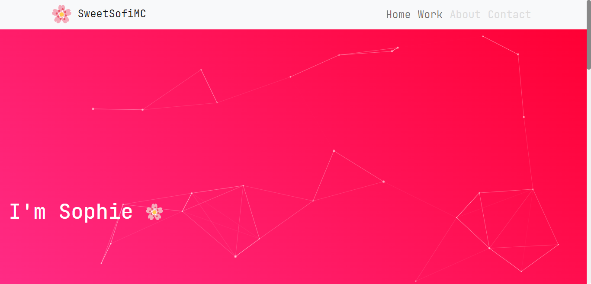

  

<h1 align="center">
  iamsofi.dev
</h1>

  
  

This project is my personal website/portfolio. It contains information about me and my projects.

## 📌 Project usage

You are allowed fork this project as long as you keep the license and give credit for the work, do **not** claim it as yours.

## 🚀 Getting started

- Clone the repository
- Locate the frontend folder and run `npm install`
- Run `npm start`

And as easy as that you'll have a development server up and running. To learn more about React check out the [React documentation](https://reactjs.org/).

### ⚒ Editing projects data

There is a data file under `src/components/ProjectPage/data.js`. You can edit it to add more projects, but you'll also need to modify the `src/components/Home/index.jsx` file in order for the projects to appear properly in the landing page.

### ✨ Editing greeting messages

You can edit these messages in `src/components/GreetingAnimation/messages.js`